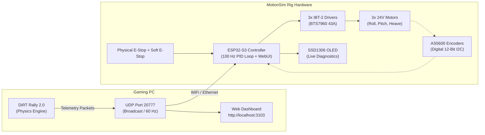

# 🏎️ MotionSim Setup, Telemetry & Hardware Guide

This comprehensive guide walks through setting up the MotionSim 3DOF motion simulator rig, configuring DiRT Rally telemetry output, launching the **Local Web Telemetry Dashboard** on `http://localhost:3103/`, connecting the **ESP32-S3 MotionSimBot** motion controller, using the embedded **MyBot-style WebUI & Oscilloscope** on `http://motionsimbot1.local/`, and running diagnostics, closed-loop PID commissioning, and wireless OTA updates.

---

> [!NOTE]
> **ESP-IDF v5.5 Build Environment on Windows:**
> ```powershell
> powershell -NoProfile -ExecutionPolicy Bypass -Command ". 'C:\Espressif\tools\Microsoft.v5.5.4.PowerShell_profile.ps1'; idf.py --version"
> ```

---

## 📐 System Architecture Overview



---

## 🌐 1. MotionSimBot Embedded WebUI (`http://motionsimbot1.local/`)

The ESP32-S3 controller serves an embedded, high-performance WebUI ported from the MyBot robotics platform:

* **Synchronized System Time:** Synced via NTP and browser clock with millisecond precision (`/time` and `/sync_time`).
* **Hero Safety Supervisor:** Massive pulsing Emergency Stop button (`🚨 EMERGENCY STOP`), safe ARM/DISARM toggles, and multi-hazard auto E-stop detection with exact trip reasoning.
* **Live Oscilloscope (Pretty Plots):** Real-time dual-trace HTML5 canvas chart running at 60 FPS plotting:
  * **Cyan line:** Target Angle ($\theta_\text{target}$)
  * **Purple line:** Actual AS5600 Angle ($\theta_\text{actual}$)
  * **Amber shaded band:** Motor PWM Duty ($D_\text{pwm}$)
* **Interactive Step Testing:** Quick `+5°`, `-5°`, `+10°`, `-10°`, `180° Center` buttons directly above the plot.
* **Direct Angle Command:** Input any desired angle and click **Go to Angle** to position the motor in real time (`POST /api/target?joint=1&angle=...`).
* **Manual Commissioning & Jogging:** Test forward and reverse duty (25%) with 400 ms safety timeout before closing the loop, with software motor polarity inversion toggle saved to flash NVS.
* **Closed-Loop PD Autocalibration:** One-click **⚡ Autocalibrate PD** routine that executes small step perturbations, measures rise time and overshoot, derives optimal $K_p$ and $K_d$, and saves to flash NVS.
* **Wireless OTA Firmware Updates:** Drag-and-drop or select any compiled `.bin` firmware file to flash the ESP32-S3 over WiFi with an animated progress bar.

---

## 🎮 2. DiRT Rally Telemetry Configuration

To transmit live physics, G-forces, suspension travel, and vehicle dynamics from DiRT Rally to the MotionSim software, enable the UDP output in the game's configuration file.

### Editing `hardware_settings_config.xml`

1. Navigate to your DiRT Rally configuration folder:
   - **DiRT Rally 2.0:** `Documents\My Games\DiRT Rally 2.0\hardwaresettings\hardware_settings_config.xml`
   - **DiRT Rally 1:** `Documents\My Games\DiRT Rally\hardwaresettings\hardware_settings_config.xml`
   - **EA SPORTS WRC:** Located in `%LOCALAPPDATA%\WRC\Saved\Config\WindowsNoEditor\`

2. Open `hardware_settings_config.xml` in an editor.
3. Search for the `<motion_platform>` XML block.
4. Replace or modify the `<udp>` entry as follows:

```xml
<motion_platform>
    <dbox enabled="true" />
    <udp enabled="true" extradata="3" ip="127.0.0.1" port="20777" delay="1" />
    <custom_udp enabled="false" filename="packet_data.xml" ip="127.0.0.1" port="20777" delay="1" />
    <fanatec enabled="true" pedalVibrationScale="1.0" wheelVibrationScale="1.0" ledTrueForGearsFalseForSpeed="true" />
</motion_platform>
```

---

## 🔌 3. ESP32-S3 Pinout & Wiring Reference

| Component | Pin Function | ESP32-S3 Pin | Physical Header Label | Description / Notes |
| :--- | :--- | :--- | :--- | :--- |
| **I2C Bus (AS5600 & OLED)** | SDA (Data)<br/>SCL (Clock) | `GPIO 1`<br/>`GPIO 2` | Right Header **`1`**<br/>Right Header **`2`** | Standard 100 kHz bus: AS5600 @ 0x36, OLED @ 0x3C |
| **Emergency Stop Line** | Driver Enable (`R_EN` + `L_EN`) | `GPIO 17` | Left Header `17` | Shared active-HIGH enable across all 3 IBT-2 drivers |
| **Motor 1 (Roll / Front Left)** | RPWM (Forward)<br/>LPWM (Reverse) | `GPIO 4`<br/>`GPIO 5` | Left Header `4`<br/>Left Header `5` | 20 kHz PWM to IBT-2 BTS7960 driver |
| **Motor 2 (Pitch / Front Right)**| RPWM (Forward)<br/>LPWM (Reverse) | `GPIO 6`<br/>`GPIO 7` | Left Header `6`<br/>Left Header `7` | 20 kHz PWM to IBT-2 BTS7960 driver |
| **Motor 3 (Heave / Rear)** | RPWM (Forward)<br/>LPWM (Reverse) | `GPIO 15`<br/>`GPIO 16` | Left Header `15`<br/>Left Header `16` | 20 kHz PWM to IBT-2 BTS7960 driver |
| **Physical E-Stop Button** | E-Stop Switch | `GPIO 18` | Left Header `18` | Hardware emergency stop button (Internal Pullup, Active LOW) |
| **Status RGB NeoPixel** | Built-in WS2812 | `GPIO 48` | Onboard | Single-wire RMT driver (Green=Running, Red=E-Stop, Amber=Connecting) |

> [!WARNING]
> **Power Supply & Grounding:**
> - Motors require high-current 12V/24V power supplies.
> - **Never power motors from the ESP32 3.3V/5V rails.**
> - Ensure a **common ground (GND)** connection between the ESP32-S3, the IBT-2 logic GND, the AS5600 GND, and the motor power supply negative terminal.

---

## 🛠️ 4. Building & Flashing the ESP32-S3 Firmware

### Automated One-Click Build Script
Run the automated PowerShell build pipeline from the root directory:
```powershell
.\buildbinesp32s3.ps1
```
This compiles the firmware and generates ready-to-flash binaries in `rdytoflashbin/`:
- `motionsimbot.bin` (Application binary)
- `bootloader.bin`
- `partition-table.bin`
- `motionsimbot_factory_4mb.bin` (Single merged image flashable at offset `0x0`)

### Flashing over USB-Serial
```powershell
.\flashbinesp32s3.ps1 COM9
```

### Wireless Flashing over WiFi (OTA)
Once flashed initially via USB:
1. Open **`http://motionsimbot1.local/`** in your browser.
2. Scroll to the **OTA Firmware Update** card.
3. Select `rdytoflashbin/motionsimbot.bin`.
4. Click **Flash Firmware**. The progress bar will stream the binary to flash and automatically reboot the device!

---

## 🛡️ 5. Commissioning, Tuning & Safety Procedures

### 1. Initial Motor Commissioning
1. Power up the ESP32-S3 and 12V/24V power supply.
2. Open `http://motionsimbot1.local/`.
3. Verify that the **Magnet Status** pill reads **Magnet OK**.
4. Click **`⚡ ARM MOTORS`**.
5. Click **`Jog FWD (25%)`** to test movement.
6. Verify rotation direction: if angle moves opposite to target, check **Invert Motor 1 Polarity**.

### 2. PD Autocalibration
1. Align the joint in a safe mid-range travel area.
2. Click **`⚡ Autocalibrate PD`**.
3. The controller performs a small step perturbation, measures rise time and damping, and derives $K_p$ and $K_d$.
4. Click **`💾 Save to Flash`** to make gains permanent.

### 3. Multi-Hazard Automatic E-Stop
The automatic E-stop trips and cuts motor power immediately if:
- **Runaway / Reversed Wiring:** Motor duty applied towards target, but error increases for >200 ms.
- **Actuator Stall / Jam:** High duty (>25%) applied for >1.2 s with zero movement.
- **Velocity / Sensor Jump:** Angle changes >18° in a single 10 ms cycle (>1800°/s jump; detached magnet).
- **Magnet Loss:** AS5600 STATUS register drops Magnet Detected (`MD=0`).
