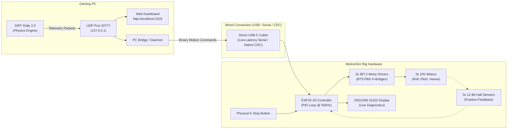

# 🏎️ MotionSim Setup, Telemetry & Hardware Guide

This comprehensive guide walks through setting up the MotionSim 3DOF motion simulator rig, configuring DiRT Rally telemetry output, launching the **Local Web Telemetry Dashboard** on `http://localhost:3103/`, connecting the **Wired ESP32-S3** motion controller, and running diagnostics and calibration.

---

## 📐 System Architecture Overview



> [!TIP]
> **Why Wired ESP32-S3 over Wireless?**
> We recommend and prioritize a **wired USB-C / high-speed Serial connection** (or wired Ethernet) directly between the PC and ESP32-S3. Wired communication guarantees deterministic, sub-millisecond latency (<1 ms), eliminates WiFi jitter/packet drops, prevents RF interference from 24V motor PWM switching noise, and avoids router/network congestion.

---

## 🎮 1. DiRT Rally Telemetry Configuration

To transmit live physics, G-forces, suspension travel, and vehicle dynamics from DiRT Rally to the MotionSim software, enable the UDP output in the game's configuration file.

### Editing `hardware_settings_config.xml`

1. Navigate to your DiRT Rally configuration folder:
   - **DiRT Rally 2.0:** `Documents\My Games\DiRT Rally 2.0\hardwaresettings\hardware_settings_config.xml`
   - **DiRT Rally 1:** `Documents\My Games\DiRT Rally\hardwaresettings\hardware_settings_config.xml`
   - **EA SPORTS WRC:** Located in `%LOCALAPPDATA%\WRC\Saved\Config\WindowsNoEditor\`

2. Open `hardware_settings_config.xml` in an editor (e.g. VS Code or Notepad).
3. Search for the `<motion_platform>` XML block.
4. Replace or modify the `<udp>` entry as follows:

```xml
<motion_platform>
    <dbox enabled="true" />
    <udp enabled="true" extradata="3" ip="127.0.0.1" port="20777" delay="1" />
    <custom_udp enabled="false" filename="packet_data.xml" ip="127.0.0.1" port="20777" delay="1" />
    <fanatec enabled="true" pedalVibrationScale="1.0" wheelVibrationScale="1.0" ledTrueForGearsFalseForSpeed="true" />
</motion_platform>
```

### Parameter Reference
| Attribute | Value | Purpose |
| :--- | :--- | :--- |
| `enabled` | `"true"` | Activates game UDP telemetry output. |
| `extradata` | `"3"` | **Critical:** Sends the full 264-byte Codemasters format containing 66 float32 fields (suspension position, suspension velocity, wheel speed, and G-force vectors). |
| `ip` | `"127.0.0.1"` | Directs packets to the local PC host loopback interface. |
| `port` | `"20777"` | The standard Codemasters UDP listening port. |
| `delay` | `"1"` | Frame delay interval (`1` delivers maximum 60–100 Hz update rate). |

> [!IMPORTANT]
> Always save the file and restart DiRT Rally if it was running while making these changes.

---

## 💻 2. Starting the Front-End Telemetry Dashboard (`http://localhost:3103/`)

The MotionSim project includes a real-time web telemetry dashboard located in the `udp_viewer/` directory. It listens for incoming DiRT Rally UDP packets on port `20777` and displays vehicle dynamics on a web interface at **`http://localhost:3103/`**.

```
motionsim/
├── udp_viewer/
│   ├── public/
│   │   ├── index.html       # Web UI layout & gauge views
│   │   ├── script.js        # Telemetry parser & Chart.js engine
│   │   └── style.css        # Glassmorphism dark cyberpunk theme
│   ├── package.json         # Node.js dependencies
│   └── server.js            # Express + Socket.IO + UDP listener (Port 3103 / 20777)
```

### Step 1: Install Dependencies
Open a PowerShell or Command Prompt terminal in the project directory:

```bash
cd udp_viewer
npm install
```

### Step 2: Launch the Server
Start the Node.js telemetry server:

```bash
npm start
# or:
node server.js
```

You will see output confirming both listeners are active:
```text
📡 UDP Server listening on port 20777
🚀 Web Dashboard running at http://localhost:3103
```

### Step 3: Open the Web UI
Open your browser and navigate to:
👉 **`http://localhost:3103/`**

### Dashboard Features & Views
* **Connection Status Indicator**: Displays real-time connection state (`Listening on UDP 20777` when connected).
* **Speed & Gear Panel**: Live speedometer in km/h, digital gear readout (R, N, 1–6), and an animated RPM tachometer bar.
* **3DOF G-Force Visualizer**:
  * **Sway (X Axis)**: Lateral cornering acceleration ($G_x$).
  * **Heave (Y Axis)**: Vertical bump & jump acceleration ($G_y$).
  * **Surge (Z Axis)**: Longitudinal acceleration & braking force ($G_z$).
  * **G-Force Dot**: Interactive 2D vector indicator plotting active load transfer.
* **Vehicle Attitude**: Pitch, Roll, and Yaw rotational degrees.
* **4-Corner Suspension Telemetry**: Live travel, velocity, and tire patch linear speed for Front-Left (FL), Front-Right (FR), Rear-Left (RL), and Rear-Right (RR).
* **Live RAW Packet Inspector**: Click **"Enable RAW View"** to inspect incoming 264-byte binary payloads, hex dumps, and packet sequence metrics.

---

## 🔌 3. Wired ESP32-S3 Hardware Setup & Pinout

For reliable, jitter-free physical motion, we use a **wired USB-C connection** (via high-speed UART or native USB CDC) to connect the Gaming PC to the ESP32-S3 motion controller.

### Hardware Connection Scheme
```
[Gaming PC] === USB-C Cable ===> [ESP32-S3 Controller]
                                         │
       ┌────────────────┬────────────────┼────────────────┬───────────────┐
       ▼                ▼                ▼                ▼               ▼
 [IBT-2 Driver 1] [IBT-2 Driver 2] [IBT-2 Driver 3] [Hall Sensors]  [SSD1306 OLED]
 (Roll / FL)      (Pitch / FR)     (Heave / Rear)   (Joint 1, 2, 3) (I2C: SDA/SCL)
```

### ESP32-S3 Pinout & Wiring Table

| Component | Pin Function | ESP32-S3 Pin | Description / Notes |
| :--- | :--- | :--- | :--- |
| **PC Host Link** | USB D+ / D- / VBUS | `Native USB` or `UART0` | USB-C data cable (Baud: 115200 or 921600) |
| **Motor 1 (Front Left / Roll)** | RPWM (Forward)<br/>LPWM (Reverse) | `GPIO 4`<br/>`GPIO 5` | IBT-2 H-Bridge PWM control (20 kHz) |
| **Motor 2 (Front Right / Pitch)** | RPWM (Forward)<br/>LPWM (Reverse) | `GPIO 6`<br/>`GPIO 7` | IBT-2 H-Bridge PWM control (20 kHz) |
| **Motor 3 (Rear Center / Heave)** | RPWM (Forward)<br/>LPWM (Reverse) | `GPIO 15`<br/>`GPIO 16` | IBT-2 H-Bridge PWM control (20 kHz) |
| **Emergency Stop Line** | Driver Enable (`R_EN` + `L_EN`) | `GPIO 17` | Shared hardware enable (Active HIGH, pull-down to GND) |
| **Hall Sensor 1 (Motor 1)** | Analog Output (0–3.3V) | `GPIO 1` (ADC1_CH0) | Joint 1 12-bit position feedback ($0.088^\circ$ resolution) |
| **Hall Sensor 2 (Motor 2)** | Analog Output (0–3.3V) | `GPIO 2` (ADC1_CH1) | Joint 2 12-bit position feedback ($0.088^\circ$ resolution) |
| **Hall Sensor 3 (Motor 3)** | Analog Output (0–3.3V) | `GPIO 3` (ADC1_CH2) | Joint 3 12-bit position feedback ($0.088^\circ$ resolution) |
| **SSD1306 OLED (0.96")** | SDA (Data)<br/>SCL (Clock) | `GPIO 8`<br/>`GPIO 9` | I2C diagnostic screen (400 kHz) |
| **Physical E-Stop Button** | E-Stop Switch | `GPIO 18` | Hardware emergency stop button (Internal Pullup, Active LOW) |
| **Status RGB / LED** | Built-in WS2812 / LED | `GPIO 48` / `GPIO 38`| Color-coded system status (Green=Running, Red=E-Stop, Amber=Safety Watchdog) |

> [!WARNING]
> **Power Supply & Grounding:**
> - Motors require high-current 24V power supplies (e.g. 2x Mean Well LRS-350-24).
> - **Never power motors directly from the ESP32 3.3V/5V rail.**
> - Ensure a **common ground (GND)** connection between the ESP32-S3, the IBT-2 driver logic GND, the Hall sensors, and the 24V power supply negative terminal.

---

## 🛠️ 4. Building & Flashing the ESP32-S3 Firmware

The production firmware is located in `motionsimbot/`.

### 1. Open ESP-IDF Environment
Open an ESP-IDF terminal (ESP-IDF v5.1+ recommended):

```bash
cd motionsimbot
```

### 2. Set Target and Configure Board
```bash
idf.py set-target esp32s3
idf.py menuconfig
```
* Under **Component config → MotionSim Hardware Configuration**, verify your configured GPIO pins.
* If using wired USB Serial, enable **ESP System Settings → Channel for console output → USB CDC**.

### 3. Build & Flash over USB
```bash
idf.py build
idf.py -p COMx flash monitor
```
*(Replace `COMx` on Windows with your device COM port, e.g. `COM3` or `COM7`)*

---

## 🧪 5. Testing with `motionsimbench` & Cyberpunk PC Dashboard

Before operating under full motor load, validate PC-to-controller communication and telemetry flow using `motionsimbench` and the Python benchmark tool:

```bash
python bench_pc_dashboard.py
```

* Open the benchmark dashboard at **`http://localhost:8080`**.
* Verify round-trip latency (RTT $p99 < 2\text{ ms}$ over wired USB/Serial connection).
* Confirm 0% packet loss and steady 60 Hz frame rate.

---

## 🛡️ 6. Calibration, Tuning & Safety Procedures

### 1. Joint Zero-Point Calibration
On first assembly or mechanical adjustment:
1. Manually align the motion rig to its level horizontal home position.
2. Trigger the zero-point calibration routine via the USB-Serial CLI or web API:
   ```text
   CALIBRATE 1
   CALIBRATE 2
   CALIBRATE 3
   ```
3. Current Hall sensor counts will be stored in ESP32 non-volatile storage (NVS) as the $0.0^\circ$ center reference.

### 2. PID Tuning Guidelines
Closed-loop position PID runs on Core 1 of the ESP32-S3 at 500 Hz:
* **$K_p$ (Proportional)**: Increases responsiveness and stiffness. Increase until the platform follows movements tightly without hunting.
* **$K_i$ (Integral)**: Eliminates steady-state position droop under rider weight. Keep low (e.g. 0.01–0.05) and clamp integral windup.
* **$K_d$ (Derivative)**: Dampens overshoot and mechanical resonance. Increase if the rig oscillates when reversing direction.

### 3. Built-In Safety Systems
* **Watchdog Timeout**: If no new telemetry packet is received for **>100 ms**, the safety watchdog trips, disabling driver PWM and parking the rig safely.
* **Duty Cycle Clamping**: Motor outputs are hard-limited to 80% maximum duty (819/1023) to prevent driver overcurrent.
* **Hardware E-Stop**: The physical E-Stop button instantly cuts the active-high IBT-2 enable line (`GPIO 17`), removing motor torque immediately.

---

## ❓ 7. Troubleshooting Matrix

| Issue | Root Cause | Solution |
| :--- | :--- | :--- |
| **Web UI (`:3103`) says "Disconnected from Backend"** | Node.js server not running or port blocked | Run `npm start` in `udp_viewer/` directory; verify no conflicting process is using port 3103. |
| **Web UI connected, but gauges stay at 0 while driving** | DiRT Rally UDP not sending or wrong XML settings | 1. Check `hardware_settings_config.xml` has `extradata="3"` and `ip="127.0.0.1"`.<br/>2. Allow DiRT Rally through Windows Firewall for UDP traffic.<br/>3. Verify game was restarted after editing XML. |
| **Port 20777 conflict error (`EADDRINUSE`)** | Another telemetry tool (SimHub, MoTeC, old script) is listening on 20777 | Close any background telemetry bridges or instances of `bench_pc_dashboard.py` before starting `udp_viewer`. |
| **ESP32-S3 not detected on COM port** | Missing USB-to-UART / CDC driver | Install Espressif USB-JTAG/Serial or CH343/CP210x drivers from Device Manager. |
| **Erratic or jittery motor movement** | Sensor noise or ground loop | 1. Ensure all GND lines are tied together.<br/>2. Add 0.1 µF ceramic bypass capacitors on Hall sensor analog signal pins to GND. |
| **Motors do not engage** | E-Stop tripped or enable pin low | Check physical E-Stop button state; verify `GPIO 17` (IBT-2 Enable) is driven HIGH during operation. |

---

## 🚀 Quick Start Summary

```bash
# 1. Edit DiRT Rally config (extradata="3", ip="127.0.0.1", port="20777")
# 2. Launch Local Web Telemetry Dashboard:
cd udp_viewer
npm install
npm start

# 3. Open browser:
http://localhost:3103/

# 4. Plug in wired ESP32-S3 over USB-C, launch DiRT Rally, and drive!
```
